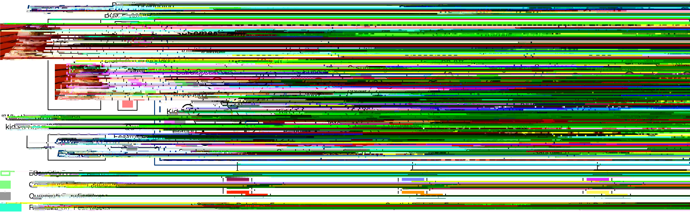

# Relation-aware Graph Attention Network for Visual Question Answering

This repository is the implementation of [Relation-aware Graph Attention Network for Visual Question Answering](https://arxiv.org/abs/1903.12314).



This repository is based on and inspired by @hengyuan-hu's [work](https://github.com/hengyuan-hu/bottom-up-attention-vqa) and @Jin-Hwa Kim's [work](https://github.com/jnhwkim/ban-vqa). We sincerely thank for their sharing of the codes.

## Prerequisites

You may need a machine with 4 GPUs with 16GB memory each, and PyTorch v1.0.1 for Python 3.

1. Install [PyTorch](http://pytorch.org/) with CUDA10.0 and Python 3.7.
2. Install [h5py](http://docs.h5py.org/en/latest/build.html).
3. Install [block.bootstrap.pytorch](https://github.com/Cadene/block.bootstrap.pytorch).

If you are using miniconda, you can install all the prerequisites with `tools/environment.yml`.

## Data

Our implementation uses the pretrained features from [bottom-up-attention](https://github.com/peteanderson80/bottom-up-attention), the adaptive 10-100 features per image. In addition to this, the GloVe vectors and Visual Genome question answer pairs. For your convenience, the below script helps you to download preprocessed data.

```bash
source tools/download.sh
```

In addition to data, this script also download several pretrained models. In the end, the data folder and pretrained_models folder should be organized as shown below:

```bash
├── data
│   ├── Answers
│   │   ├── v2_mscoco_train2014_annotations.json
│   │   └── v2_mscoco_val2014_annotations.json
│   ├── Bottom-up-features-adaptive
│   │   ├── train.hdf5
│   │   ├── val.hdf5
│   │   └── test2015.hdf5
│   ├── Bottom-up-features-fixed
│   │   ├── train36.hdf5
│   │   ├── val36.hdf5
│   │   └── test2015_36.hdf5
│   ├── cache
│   │   ├── cp_v2_test_target.pkl
│   │   ├── cp_v2_train_target.pkl
│   │   ├── train_target.pkl
│   │   ├── val_target.pkl
│   │   ├── trainval_ans2label.pkl
│   │   └── trainval_label2ans.pkl
│   ├── cp_v2_annotations
│   │   ├── vqacp_v2_test_annotations.json
│   │   └── vqacp_v2_train_annotations.json
│   ├── cp_v2_questions
│   │   ├── vqacp_v2_test_questions.json
│   │   └── vqacp_v2_train_questions.json
│   ├── glove
│   │   ├── dictionary.pkl
│   │   ├── glove6b_init_300d.npy
│   │   └──- glove6b.300d.txt
│   ├── imgids
│   │   ├── test2015_36_imgid2idx.pkl
│   │   ├── test2015_ids.pkl
│   │   ├── test2015_imgid2idx.pkl
│   │   ├── train36_imgid2idx.pkl
│   │   ├── train_ids.pkl
│   │   ├── train_imgid2idx.pkl
│   │   ├── val36_imgid2idx.pkl
│   │   ├── val_ids.pkl
│   │   └── val_imgid2idx.pkl
│   ├── Questions
│   │   ├── v2_OpenEnded_mscoco_test-dev2015_questions.json
│   │   ├── v2_OpenEnded_mscoco_test2015_questions.json
│   │   ├── v2_OpenEnded_mscoco_train2014_questions.json
│   │   └── v2_OpenEnded_mscoco_val2014_questions.json
│   ├── visualGenome
│   │   ├── image_data.json
│   │   └── question_answers.json
```

```bash
├── pretrained_models (each model folder contains hps.json and model.pth)
│   ├── regat_implicit
│   │   ├── ban_1_implicit_vqa_196
│   │   ├── ban_4_implicit_vqa_cp_4422
│   │   ├── butd_implicit_vqa_6371
│   │   └── mutan_implicit_vqa_2632
│   ├── regat_semantic
│   │   ├── ban_1_semantic_vqa_7971
│   │   ├── ban_4_semantic_vqa_cp_9960
│   │   ├── butd_semantic_vqa_244
│   │   └── mutan_semantic_vqa_2711
│   ├── regat_spatial
│   │   ├── ban_1_spatial_vqa_1687
│   │   ├── ban_4_spatial_vqa_cp_4488
│   │   ├── butd_spatial_vqa_5942
│   │   └── mutan_spatial_vqa_3842
```

## Training

```bash
python3 main.py --config config/butd_vqa.json
```

## Evaluating

```bash
# take ban_1_implicit_vqa_196 as an example
# to evaluate cp_v2 performance, need to use --dataset cp_v2 --split test
python3 eval.py --output_folder pretrained_models/regat_implicit/ban_1_implicit_vqa_196
```

## Citation

If you use this code as part of any published research, we'd really appreciate it if you could cite the following paper:

```text
@article{li2019relation,
  title={Relation-aware Graph Attention Network for Visual Question Answering},
  author={Li, Linjie and Gan, Zhe and Cheng, Yu and Liu, Jingjing},
  journal={ICCV},
  year={2019}
}
```

## License

MIT License
